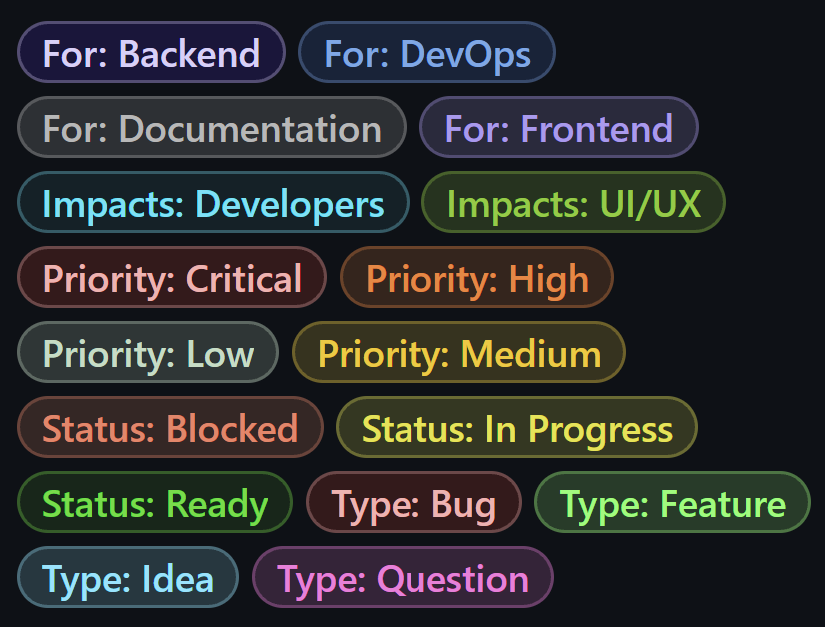
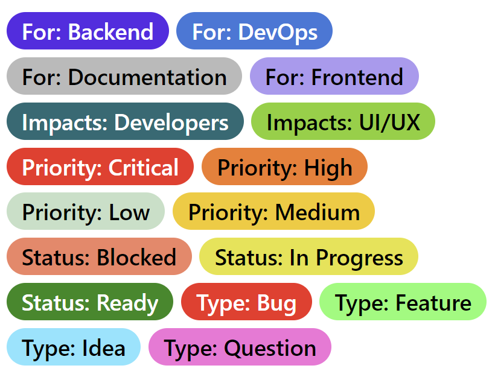

<div align="center">

# LabelTemplateRepository
GitHub labels template for copying

## Example

I provided the following template config

GitHub Dark             |  GitHub Light (Default)
:-------------------------:|:-------------------------:
  |  

## Prerequisites

Requires [Labeler](https://github.com/Zebiano/Labeler)

## Usage

Copy the `labeler_labels.json` file to the file path of `labeler -p`

Run the command:

```bash
labeler -t [ghp_GITHUB_PERSONAL_ACCESS_TOKEN] -o [USER/ORGANISATION] -r [REPOSITORY_NAME] -duf
```

`-d`: Delete all existing labels

`-u`: Upload labels from file

**Optional**
`-f`: Runs headlessly

## Recommended
  
1. Run `labeler -c` - Enters the interactive config
2. Press `Enter` - Enter and save your GitHub Access Token
3. Go to 'Owner' - Enter your default owner (typically your username)
4. Exit the interactive config
  
Now the config is setup whereby you don't need to input your username or access token on each command. This allows you do run the following:
  
```bash
labeler -r [REPOSITORY_NAME] -duf
```
  
</div>
